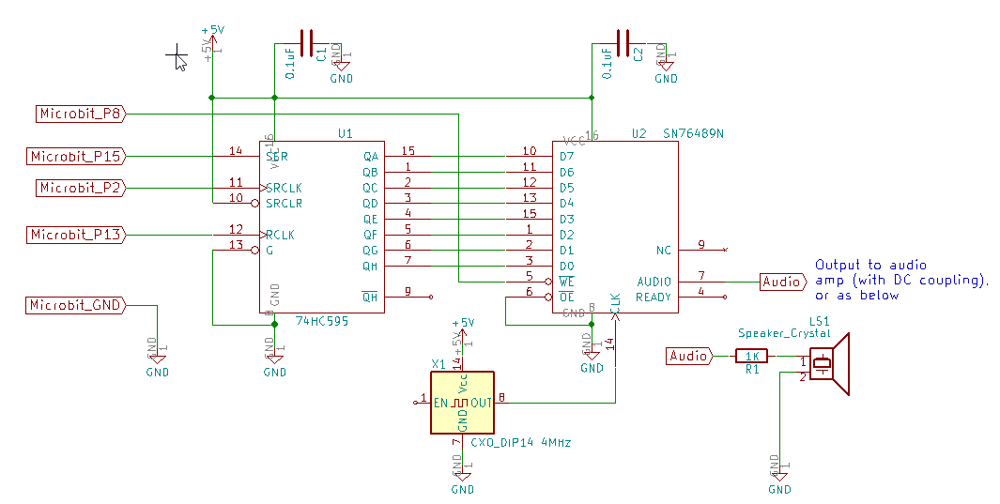
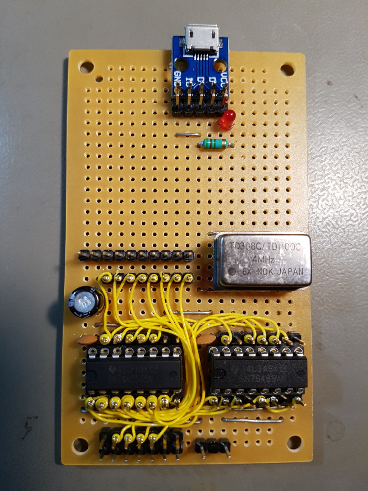

# microbit-vgmplayer
This code plays BBC micro (SN76489) VGM sound files on a BBC micro:bit - with the help of some external circuitry. The code was developed on the MBED platform: https://os.mbed.com/users/linker3000/code/Microbit-VGM/ 

This circuit interfaces the micro:bit to the SN76489N Programmable Sound Generator (PSG) using the micro:bit's SPI port and code library:

Note that this circuitry runs off its own +5V supply. Don't forget to link this circuit's and the micro:bit's 0V/GND lines for proper signal integrity. DO NOT connect the 5V line from this circuit to the 3V line on the micro:bit - something will break.

You could try using 3V from the micro:bit to power everything and omit the separate 5V supply, but the PSG and crystal oscillator are 5V parts, so YMMV. 

*Plenty of room for a 30W amplifier?!*
