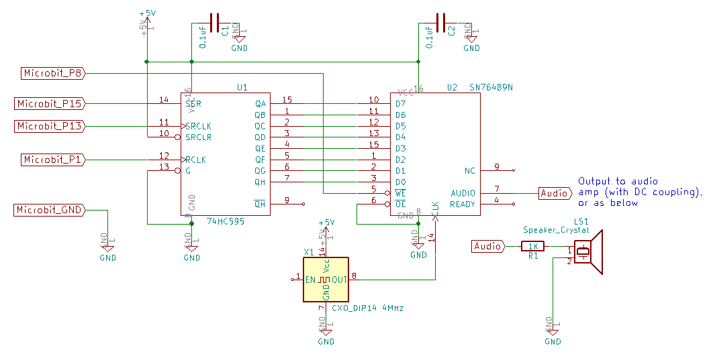

# microbit-vgmplayer
This code plays BBC micro (SN76489) VGM sound files on a BBC micro:bit - with the help of some external circuitry.

This circuit interfaces the micro:bit to the SN76489 Programmable Sound Generator (PSG):

